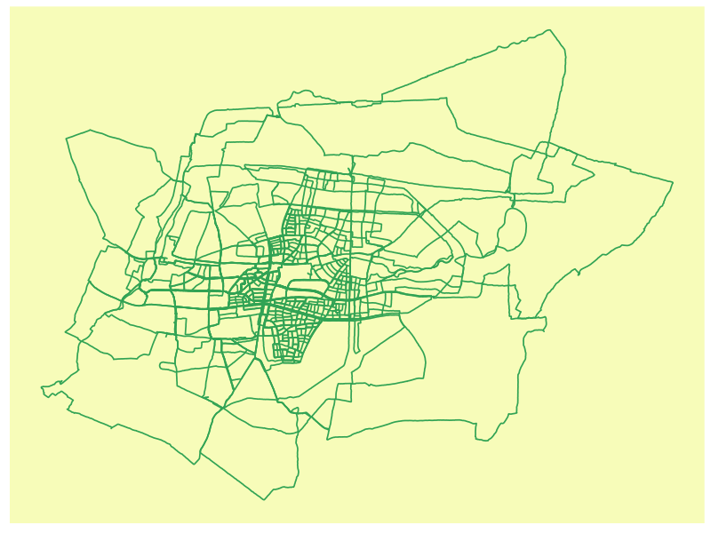
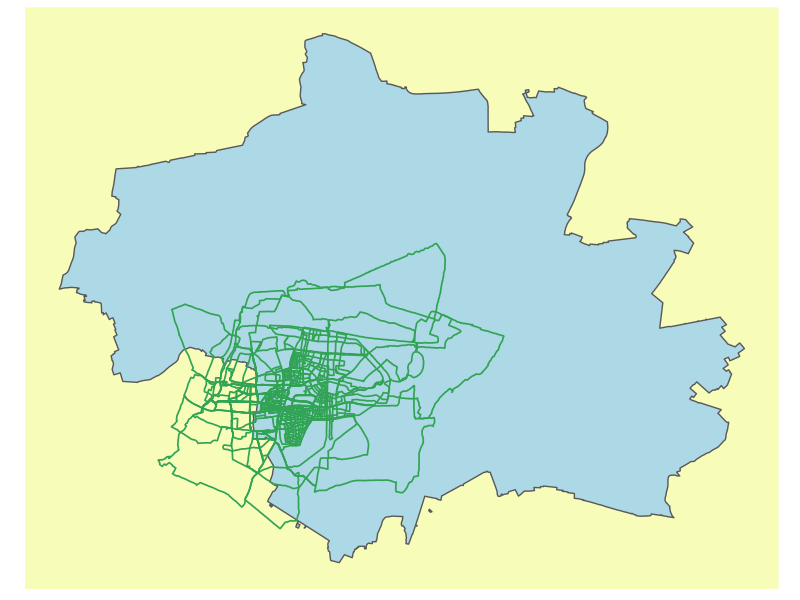

Runningdata
================
Hrólfur Ásmundsson

# Working with GPX tracking data from run exercises.

The idea is to learn how to import GPX files, that are created by my
workout app during a run, extract the data and create nice graphics.

## Prepering the data

If we open up the GPX file we find that it is an XML style file where
for each time step the gps coordinates and time are stored in the
following way:

```
<trkpt lat="48.118324" lon="11.4709835">
  <ele>587.17163</ele>
  <time>2022-04-20T10:07:43Z</time>
  </trkpt>
```

To parse the data from the raw data file we will use the `XML` library,
and for graphs we will use `ggplot2`

``` r
library(XML)
library(tidyverse)
library(lubridate)
library(ggplot2)
```

From the `XML` package we can use `htlmTreeParse` to read in the file,
then we use `xpathSApply` to grab the data we want

``` r
rundata <- htmlTreeParse(file = "Munchen/07m.gpx", useInternalNodes = T)
time <- xpathSApply(rundata,"//trkpt/time",xmlValue)
elevation <- as.numeric(xpathSApply(rundata,"//trkpt/ele",xmlValue))
coordinates <- as.numeric(xpathSApply(rundata,"//trkpt",xmlAttrs))
```

The coordinates vector now includes both longitude and latitude
coordinates one after each other, this is not very helpful and we must
split it in two. I.e. we want to assign the every other element of the
vector to a latitude vector and the following element in a longitude
vector.

``` r
lattitude <- coordinates[c(TRUE,FALSE)]
longitude <- coordinates[c(FALSE,TRUE)]
```

The for time we remove the “T” and “Z” and convert it to a a datetime
format. Further we will not really need the full date and time
measurement it suffices to only know the duration of the exercise

``` r
time <- time %>% 
  str_replace_all(c("T"=" ","Z"=""))
duration <- as.numeric(as.POSIXct(time)-as.numeric(as.POSIXct(time[1])))  
```

With all those data now imported we store it in a single tibble
run_tibble and plot it using `geom_path`,

``` r
run_tibble <- tibble(time,duration,elevation,lattitude,longitude)
g1 <- ggplot(data=run_tibble,aes(x=longitude,y=lattitude))+
  geom_path()
g1
```

 This is a good start, we show that the data was
correctly imported and the `geom_path` plot gives the correct path. We
come back to making things look nice later. But, fist let’s work a
little with our tibble. We have stored lattitude and longitude
coordinates, but one might want to know the distance covered. That is we
want to convert a pair of our two angular mesurements into a distance.
The two The two points lie on a circle and to find the distance

between them we can find the angle

between the points and then the distance is the arc length between those
points

\right)")

where

is the radius of the
earth,
are the lattitude coordinates and

are the longitude coordinates in radians for points 1 and 2
respectively. This formula can lead to sizable compitational rounding
errors for small angles, we will therefore use an approximation that is
more suitable for computers

^2+((1-\sin(\Delta_\phi/2)^2)-\sin((\phi_1+\phi_2)/2)^2)*\sin(\Delta_\theta/2)^2)}")

We use this relation to find the distance between each point and then
the total distance traveled in each point is the cummulative sum of all
previous distances.

``` r
compute_distance <- function(lattitude,longitude) {
  distance <-  numeric(length(lattitude))
  R <-  6371000 #approximately earth radius
  latt_rad = lattitude*pi/180 # We need to work with radians
  long_rad = longitude*pi/180
  delta_phi = latt_rad[-length(distance)]-latt_rad[-1]
  delta_theta  = long_rad[-length(distance)]-long_rad[-1]
  sum_phi = latt_rad[-length(distance)]+latt_rad[-1]
  distance[-1] <-  R*2*sqrt(sin(delta_phi/2)^2+
                              ((1-sin(delta_phi/2)^2)-
                                 sin(sum_phi/2)^2)*sin(delta_theta/2)^2)
  return(distance)
}
```

With the distance and the time it is easy to find te speed

``` r
compute_speed <- function(t,d,n){
  N = length(d)
  speed <- numeric(N)
  for(i in 1:n){
    speed[i] = (d[i+n]-d[i])/(t[i+n]-t[i])
    speed[1+N-i] = (d[N]-d[N+1-(i+n)])/(t[N]-t[N+1-(i+n)])
  }
  speed[(n+1):(N-n)] = (d[(2*n+1):N]-d[1:(N-2*n)])/(t[(2*n+1):N]-t[1:(N-2*n)])
  return(speed)
}
```

and the total distance covered up the point

``` r
distance_covered <- cumsum(compute_distance(lattitude,longitude))
#add to out tibble
run_tibble <- run_tibble%>%
  add_column(distance_covered)
run_tibble
distance_covered[length(distance_covered)]
```

With those functions we can build our tibble with all the date we need.
We yse `Sys.glob` and the wild card “\*” to find all the files we want
to read, for me they are located in a folder called “Munchen”.

``` r
files <- (Sys.glob("Munchen/*.gpx"))
n = length(files)
for(i in 1:n){
  rundata_temp <- htmlTreeParse(files[i],useInternalNodes = T)
  time <- xpathSApply(rundata_temp,"//trkpt/time",xmlValue)%>%
    str_replace_all(c("T"=" ","Z"=""))
  duration <- as.numeric(as.POSIXct(time))-as.numeric(as.POSIXct(time[1]))
  elevation <- as.numeric(xpathSApply(rundata_temp,"//trkpt/ele",xmlValue))
  coordinates <- as.numeric(xpathSApply(rundata_temp,"//trkpt",xmlAttrs))
  lattitude <- coordinates[c(TRUE,FALSE)]
  longitude <- coordinates[c(FALSE,TRUE)]
  distance_covered <- cumsum(compute_distance(lattitude,longitude))
  speed <- compute_speed(duration,distance_covered,10)
  run_length <- rep(round(distance_covered[length(time)]/500)/2,each=length(time))
  run_number <- rep(i,each=length(time))
  if(i==1){
    run_collection <- tibble(time,
                             duration,
                             elevation,
                             lattitude,
                             longitude,
                             distance_covered,
                             speed,
                             run_length,
                             run_number
    )
  } else {
    run_collection <- run_collection %>% 
      add_row(time,
              duration,
              elevation,
              lattitude,
              longitude,
              distance_covered,
              speed,
              run_length,
              run_number
      )
  }
}
```

## Making some figures

Let’s now plot all the paths, and change the background and make it look
nice.

``` r
themerun <- theme(panel.grid = element_blank(),
                  axis.ticks = element_blank(),
                  axis.text = element_blank(),
                  axis.title = element_blank(),
                  panel.background = element_rect(fill= "#f7fcb9")
)
g2 <- ggplot(run_collection)+
  geom_path(show.legend = FALSE,
            color="#31a354",
            size=0.6,
            aes(x=longitude,
                y=lattitude,
                group=run_number,
                color=run_number
            )
  )+
  themerun
g2
```

 This is looking good, but those runs are all in München, so
we can use the `osmdata` and `geom_sf` to plot the runs relative to the
silhouette of the city

``` r
library(osmdata)
bnd <- opq(bbox = "Munich,germany")%>%
  add_osm_feature(key="admin_level",value=6)%>%
  add_osm_feature(key="name", value = "München")%>%
  osmdata_sf()
g3 <- ggplot(run_collection)+
  geom_sf(data=bnd$osm_multipolygons,fill = 'light blue')+
  geom_path(show.legend = FALSE,
            color="#31a354",
            size=0.6,
            aes(x=longitude,
                y=lattitude,
                group=run_number,
                color=run_number
            )
  )+
  themerun
g3
```



## Making a Video

We move when we run, so it is boring to just see static images. We can
use the `gganimate` to make some nice GIFs.

First a run through each of the the runs

``` r
library(gganimate)
overview_animation <- run_collection%>%
  unique()%>%
  ggplot()+
  geom_point(color="#31a354",size=0.1,aes(x=longitude,y=lattitude,group=run_number))+
  transition_states(states = run_number)+
  themerun
animate(overview_animation,end_pause = 10,renderer = gifski_renderer())
anim_save("overview_animation.gif",last_animation())
```

Secondly and perhaps more interestingly a race animation where all the
runs begin at the same time

``` r
race_animation <-  run_collection%>%
  ggplot(aes(x=longitude,y=lattitude,group=run_number))+
  geom_path(color="#31a354")+
  labs(title='Distance: {frame_along%/%1000} km')+
  transition_reveal(along = distance_covered)+
  exit_shrink()+
  themerun
animate(race_animation,end_pause=10,renderer = gifski_renderer())
anim_save("race_animation.gif",last_animation())
```

The GIFs are in the folder.
